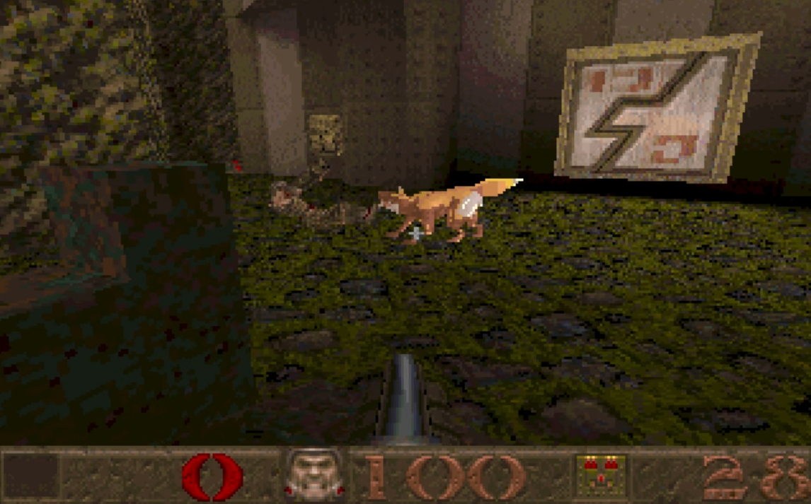

# QuakeFox 🦊 by Esb

A vibe coded Quake 1 modification that replaces the original Quake dog with a friendly fox companion.




## What changes?

### Fox model

The original Quake dog MDL was adapted into a low-poly fox while retaining the original Quake-style frame animation system.

The final fox has:

- pointed fox-like ears
- a larger, bushier fox tail
- orange/brown fur
- cream/white muzzle and tail tip
- a friendlier expression
- Quake's indexed 256-color palette
- the original dog animation structure, so existing idle, attack, pain, death, walk and other frames continue to work

The result is a genuine Quake 1 `.mdl`, not a modern skeletal model.

### Fox sounds

The original dog sounds were replaced with fox vocalizations based on a real fox recording.

There are fox variants for:

- idle
- attack
- pain
- death
- greeting/sight

The other sounds use the fox recording as their sonic reference while preserving the different roles and timing of the original Quake dog sounds.

The death sound was made longer, slightly lower in pitch, and more dramatic.

The replacement sounds use Quake-compatible mono 11.025 kHz, 16-bit PCM audio.

## Fox AI

The QuakeC modification changes the original dog AI while retaining the original dog movement and attack behavior as much as possible.

The fox has:

- **250 HP**, ten times the original dog's 25 HP
- normal player sight detection
- the ability to find and attack other living monsters
- **no ability to select the player as its enemy**
- no retaliation against the player when the player damages it
- protection against targeting other foxes
- normal Quake monster movement and attack behavior

The intended behavior is:

```text
                 Player spotted
                       |
                       v
                Search for enemy
                  /           \
                 /             \
          Monster found      None alive
               |                 |
               v                 v
          Attack monster     Follow player
               |
               v
          Enemy dies
               |
               +-------> Search again
```

If there are no suitable living enemies, the fox follows the player around the map.

If another enemy becomes available, the fox can switch back to fighting it.

The player is never intended to become the fox's enemy.

## QuakeC implementation

The AI modification is based on the original id Software Quake v1.01 QuakeC source.

Relevant files changed:

- `dog.qc` — dog/fox health and dog-specific behavior
- `ai.qc` — target acquisition and movement
- `combat.qc` — damage/retaliation handling
- `monsters.qc` — monster initialization and target handling

The existing Quake AI is reused rather than replacing the entire monster system.

## Building

The source is based on the original QuakeC v1.01 source tree, which contains files such as:

```text
ai.qc
combat.qc
dog.qc
monsters.qc
progs.src
```

A QuakeC compiler/QCC is required to compile the modified source into:

```text
progs.dat
```

Start from a clean v1.01 source tree when applying the modifications from the diff file.

I used the original qccdos.exe to compile the modified sources into progs.dat file. They original source tree and the compiler is available at: https://github.com/id-Software/Quake-Tools/

## Installation

A typical mod directory can look like:

```text
quake/
└── fox/
    ├── progs.dat
    ├── progs/
    │   └── dog.mdl
    └── sound/
        └── dog/
            ├── idle.wav
            ├── dsight.wav
            ├── dpain1.wav
            ├── ddeath1.wav
            └── dattack1.wav
```

The exact filenames should match the names referenced by the QuakeC source.

For a Quake engine/source port supporting `-game`, for example:

```bash
quake -game fox
```

The E1M1 map is great for testing as it has many dogs that become replaced, and many weak enemies to attack.

## Credits

Quake and the original QuakeC game code were created by id Software and open sourced.

QuakeFox is a modification based on the original Quake architecture and resources.

The fox model, texture work, replacement sound variants, and AI changes were vibed with ChatGPT.
